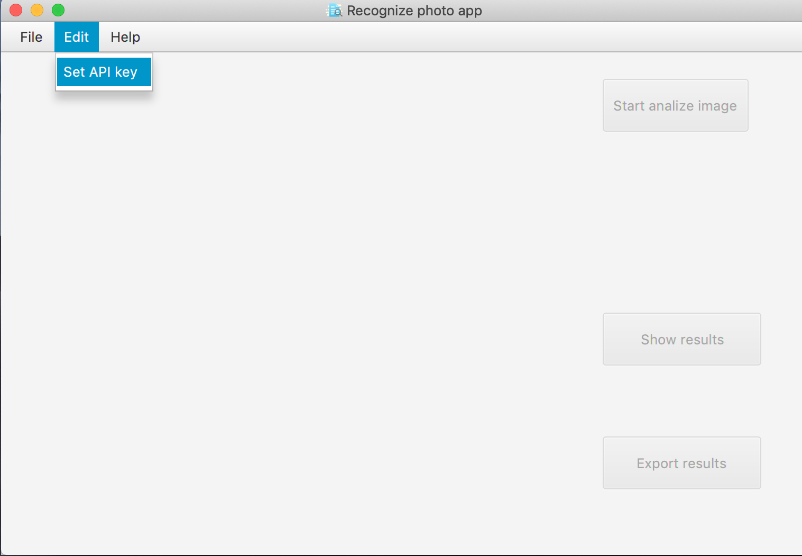
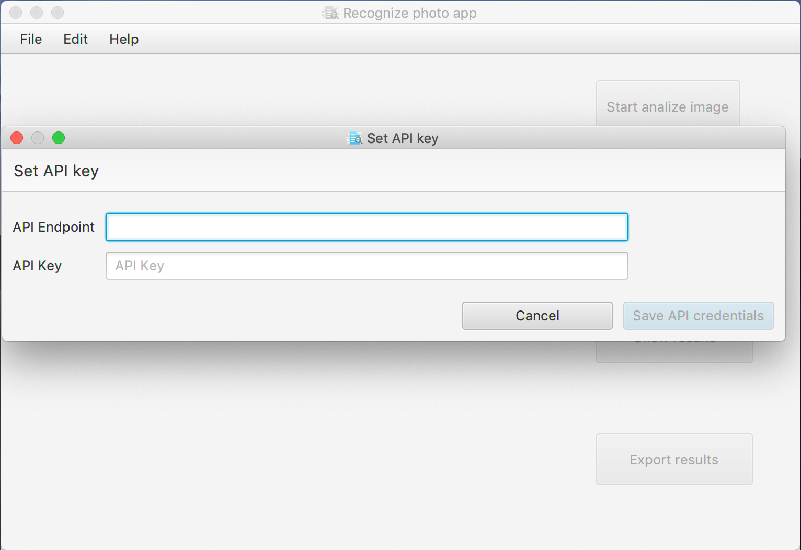
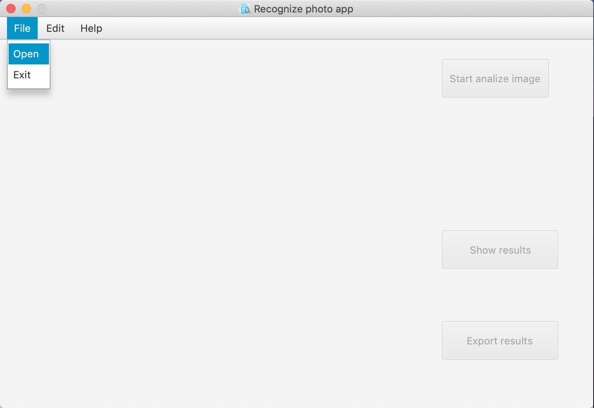
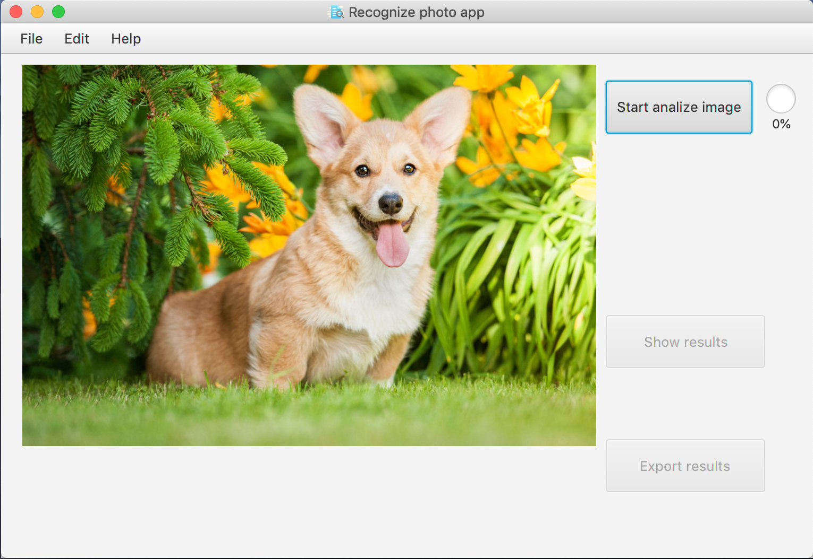
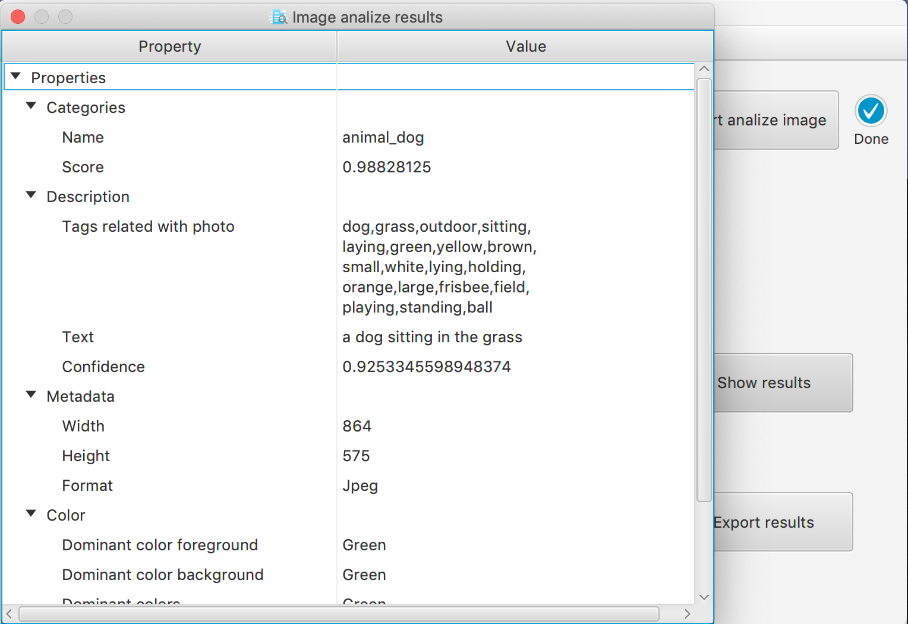
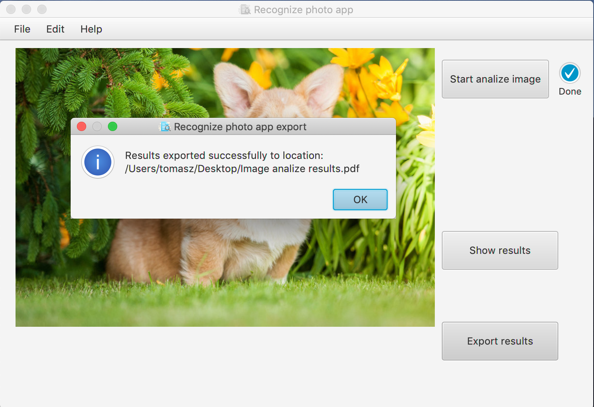
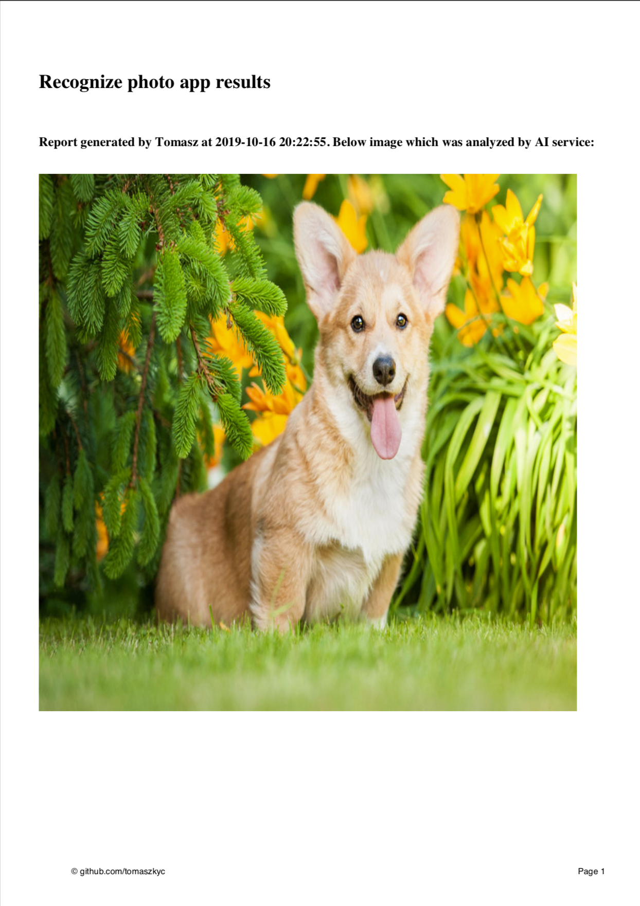
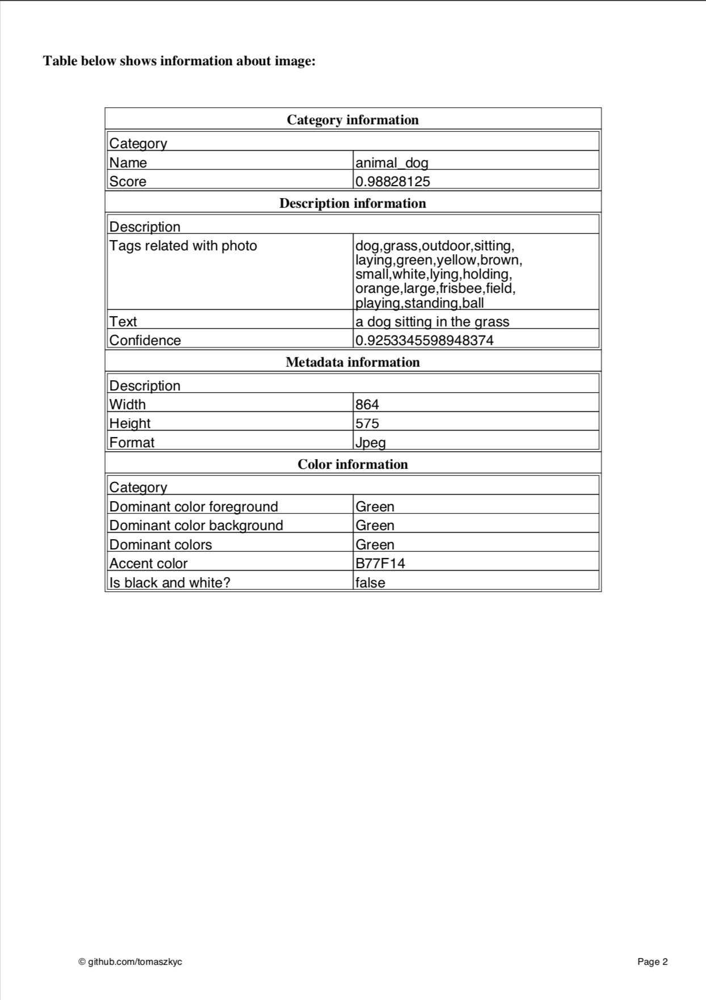

<!--
*** Thanks for checking out this README Template. If you have a suggestion that would
*** make this better, please fork the repo and create a pull request or simply open
*** an issue with the tag "enhancement".
*** Thanks again! Now go create something AMAZING! :D
***
***
***
*** To avoid retyping too much info. Do a search and replace for the following:
*** github_username, repo, twitter_handle, email
-->


<!-- PROJECT SHIELDS -->
<!--
*** I'm using markdown "reference style" links for readability.
*** Reference links are enclosed in brackets [ ] instead of parentheses ( ).
*** See the bottom of this document for the declaration of the reference variables
*** for contributors-url, forks-url, etc. This is an optional, concise syntax you may use.
*** https://www.markdownguide.org/basic-syntax/#reference-style-links
-->
[![Contributors][contributors-shield]][contributors-url]
[![Forks][forks-shield]][forks-url]
[![Stargazers][stars-shield]][stars-url]
[![Issues][issues-shield]][issues-url]
[![MIT License][license-shield]][license-url]
[![LinkedIn][linkedin-shield]][linkedin-url]


<!-- PROJECT LOGO -->
<br />
<p align="center">
  <a href="https://github.com/tomaszkyc/recognize-photo-app">
    
  </a>

  <h3 align="center">Recognize photo app</h3>

  <p align="center">
    Simple app to recognize photo objects using <a href="https://azure.microsoft.com/en-us/services/cognitive-services/computer-vision/">Microsoft Azure Cognitive Services</a>
    <br />
    <a href="https://github.com/tomaszkyc/recognize-photo-app"><strong>Explore the docs »</strong></a>
    <br />
    <br />
    <a href="https://github.com/tomaszkyc/recognize-photo-app#usage">View Demo</a>
    ·
    <a href="https://github.com/tomaszkyc/recognize-photo-app/issues">Report Bug</a>
    ·
    <a href="https://github.com/tomaszkyc/recognize-photo-app/issues">Request Feature</a>
  </p>
</p>


<!-- TABLE OF CONTENTS -->
## Table of Contents

* [About the Project](#about-the-project)
  * [Built With](#built-with)
* [Getting Started](#getting-started)
  * [Prerequisites](#prerequisites)
  * [Installation from sources](#Installation-from-sources)
  * [Installation using builded jar](#Installation-using-builded-jar)
* [Usage](#usage)
* [Contributing](#contributing)
* [License](#license)
* [Contact](#contact)


<!-- ABOUT THE PROJECT -->
## About The Project

[![Product Name Screen Shot][product-screenshot]](https://example.com)

Project is an simple app using [Microsoft Azure Cognitive Services](https://azure.microsoft.com/en-us/services/cognitive-services/computer-vision/) which can be used for recognizing objects on images.


### Built With

* [Amazon Corretto 11 openJDK](https://docs.aws.amazon.com/corretto/latest/corretto-11-ug/what-is-corretto-11.html)
* [OpenJFX](https://openjfx.io)
* [Maven](https://maven.apache.org)
* [Microsoft Azure Cognitive Services](https://azure.microsoft.com/en-us/services/cognitive-services/computer-vision/)


<!-- GETTING STARTED -->
## Getting Started

To get a local copy up and running follow these simple steps.

### Prerequisites

1. You need to install [Amazon Corretto 11 openJDK](https://docs.aws.amazon.com/corretto/latest/corretto-11-ug/what-is-corretto-11.html) to run an app.

2. If you want to go along with [Installation from sources](#Installation-from-sources) - you will need also [Maven](https://maven.apache.org)


### Installation from sources
 
1. Clone the repo
```sh
git clone https:://github.com/tomaszkyc/recognize-photo-app.git
```
2. Go to directory where repo exists
```sh
cd recognize-photo-app
```
3. Build with Maven
```sh
mvn clean package
```
4. Run using existing scripts:

* Mac
    ```sh
    ./run.sh
    ```
* Windows
    ```cmd
    run.bat
    ```

### Installation using builded jar

1. Download jar from [releases page](https://github.com/tomaszkyc/recognize-photo-app/releases)

2. Run jar using command below:
```sh
java -jar <path-to-downloaded-jar>
```

<!-- USAGE EXAMPLES -->
## Usage

1. To use this app we need to generate our own credentails to **Microsoft Azure Computer Vision** service. In this link there's an [how to guide](resources/docs/How-to-generate-API-Claims-to-Microsoft-Azure-Computer-Vision.pdf).

2. Open an app and go to
```
Edit -> Set API key
```
as below:



3. Put your generated **API Endpoint** and **API Key** in appropriate fiels and click **Save API credentials**




4. Open image using
```
File -> Open
```
as below:



5. Run analize image by clicking **Start analize image** button as below:



6. After analize will be finished - you can click on **Show results** button to open new window with details about image as below:




or click **Export results** button to export results to PDF file. After export you will get an alert: 





Document looks as below:





<!-- CONTRIBUTING -->
## Contributing

Contributions are what make the open source community such an amazing place to be learn, inspire, and create. Any contributions you make are **greatly appreciated**.

1. Fork the Project
2. Create your Feature Branch (`git checkout -b feature/AmazingFeature`)
3. Commit your Changes (`git commit -m 'Add some AmazingFeature'`)
4. Push to the Branch (`git push origin feature/AmazingFeature`)
5. Open a Pull Request


<!-- LICENSE -->
## License

Distributed under the MIT License. See `LICENSE` for more information.


<!-- CONTACT -->
## Contact

Email - [tomasz.kyc@outlook.com](tomasz.kyc@outlook.com)

Project Link: [https://github.com/tomaszkyc/recognize-photo-app](https://github.com/tomaszkyc/recognize-photo-app)


<!-- MARKDOWN LINKS & IMAGES -->
<!-- https://www.markdownguide.org/basic-syntax/#reference-style-links -->
[contributors-shield]: https://img.shields.io/github/contributors/tomaszkyc/recognize-photo-app.svg?style=flat-square
[contributors-url]: https://github.com/tomaszkyc/recognize-photo-app/graphs/contributors
[forks-shield]: https://img.shields.io/github/forks/tomaszkyc/recognize-photo-app.svg?style=flat-square
[forks-url]: https://github.com/tomaszkyc/recognize-photo-app/network/members
[stars-shield]: https://img.shields.io/github/stars/tomaszkyc/recognize-photo-app.svg?style=flat-square
[stars-url]: https://github.com/tomaszkyc/recognize-photo-app/stargazers
[issues-shield]: https://img.shields.io/github/issues/tomaszkyc/recognize-photo-app.svg?style=flat-square
[issues-url]: https://github.com/tomaszkyc/recognize-photo-app/issues
[license-shield]: https://img.shields.io/github/license/tomaszkyc/recognize-photo-app.svg?style=flat-square
[license-url]: https://github.com/tomaszkyc/recognize-photo-app/blob/master/LICENSE
[linkedin-shield]: https://img.shields.io/badge/-LinkedIn-black.svg?style=flat-square&logo=linkedin&colorB=555
[linkedin-url]: www.linkedin.com/in/tomaszkyc
[product-screenshot]: resources/images/icon.png
<!-- https://github.com/tomaszkyc/recognize-photo-app-->